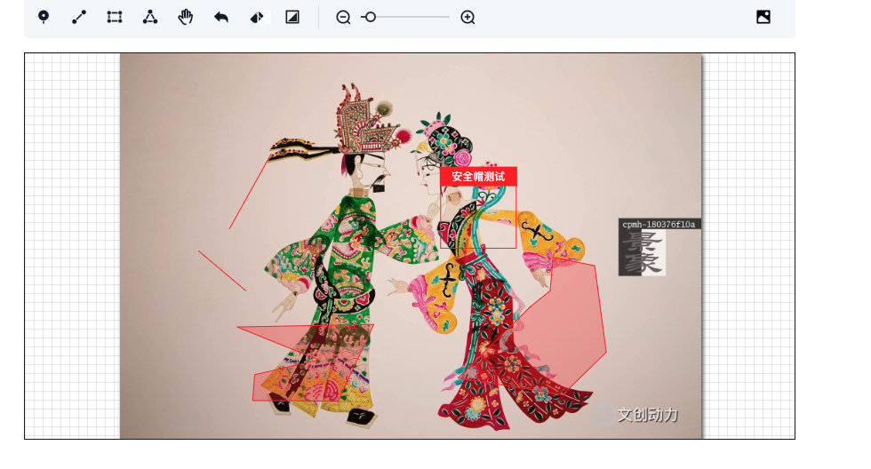

<div align="center"> <a href="https://github.com/corerain/float-collapse-menu">  </a> <br> <br>

[](LICENSE)

<h1>SvgLabel（基于svg图片标注）</h1>
</div>

**中文** | [English](./README.md)

## 简介

SvgLabel 是vue2.x组件，基于svg图片标注组件。

## 特性

- **vue**：vue2.x组件

## 预览

https://corerain.github.io/float-collapse-menu/

<p align="center">
    
</p>

## 使用

## Vue.js 2.x

组件使用:

### 基础用法:
``` html
<SvgLabel
  :img="img"
  :is-lock="false"
  :init-data="initData"
  :upload="upload" />
```
vue组件文件:
``` js
  import SvgLabel from 'svg-label'
  import testData from './test-data'
  ...
  export default {
    components: {
      SvgLabel,
    },
    data() {
      return {
        initData: testData,
        img: 'https://t7.baidu.com/it/u=2531125946,3055766435&fm=193&f=GIF'
      }
    },
    methods: {
      async upload() {
        return 'https://t7.baidu.com/it/u=4162611394,4275913936&fm=193&f=GIF'
      }
    }
  }
  ...
```

## Props

|Name|Description|Type|Required|Default|
|---|---|---|---|---|
|img|绘制底图|`String`|`false`|-|
|upload|上传图片回调|`Function`|`false`|async () => {}|
|initData|初始化绘制数据|`Array`|`false`|[{"shape":"point","points":[{"x":0.5181818181818182,"y":0.1840909090909091}]},{"shape":"rect","points":[{"x":0.33636363636363636,"y":0.4670454545454546},{"x":0.7579545454545454,"y":0.4670454545454546},{"x":0.33636363636363636,"y":0.697159090909091},{"x":0.7579545454545454,"y":0.697159090909091}]},{"shape":"polyline","points":[{"x":0.12386363636363637,"y":0.15000000000000002},{"x":0.38977272727272727,"y":0.35625},{"x":0.47613636363636364,"y":0.2028409090909091}]},{"shape":"polygon","points":[{"x":0.5965909090909091,"y":0.13977272727272727},{"x":0.5511363636363636,"y":0.34090909090909094},{"x":0.8022727272727272,"y":0.3698863636363637},{"x":0.7954545454545454,"y":0.6937500000000001},{"x":0.4738636363636364,"y":0.5607954545454545},{"x":0.7556818181818182,"y":0.1653409090909091}]}]|
|tools|操作工具|`Array`|`false`|[{"type":"drag","name":"平移","text":"平移"},{"type":"repeal","name":"撤销","text":"撤销"},{"type":"clean","name":"清空","text":"清空"},{"type":"changeBg","name":"背景","text":"背景"},{"type":"shrink","name":"缩小","text":"缩小"},{"type":"progressBar","name":"进度条","text":""},{"type":"magnify","name":"放大","text":"放大"},{"type":"upload","name":"上传图片","text":"上传图片"}]|
|drawTools|绘制工具|`Array`|`false`|[{"type":"point","name":"点","text":"点"},{"type":"polyline","name":"线","text":"线"},{"type":"rect","name":"矩形","text":"矩形"},{"type":"polygon","name":"多边形","text":"多边形"}]|
|drawEnd|每个图形绘制完成回调|`Function`|`false`|shapeInfo => {
  console.log(`drawEnd:`, shapeInfo);
}|
|clean|清空回调|`Function`|`false`|() => {}|
|initShape|初始化绘制形状|`String`|`false`|-|
|isLock|画布是否锁定|`Boolean`|`false`|false|
|defAreaConfig|默认区域配置参数|`Object`|`false`|{}|
|areaChange|默认区域移动回调|`Function`|`false`|() => {}|
|minScale|缩小最小倍数|`Number`|`false`|0.5|
|maxScale|放大最大倍数|`Number`|`false`|5|


## License

Copyright (C) 2022 Corerain. All Rights Reserved.

Licensed under the Apache License, Version 2.0 (the "License");
you may not use this file except in compliance with the License.
You may obtain a copy of the License at

    http://www.apache.org/licenses/LICENSE-2.0

Unless required by applicable law or agreed to in writing, software
distributed under the License is distributed on an "AS IS" BASIS,
WITHOUT WARRANTIES OR CONDITIONS OF ANY KIND, either express or implied.
See the License for the specific language governing permissions and
limitations under the License.
